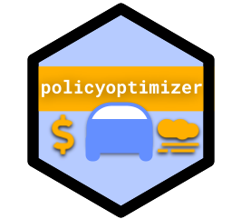

<head>
    <link rel="shortcut icon" type="image/png" href="extra/policyoptimizer_hexagon.png">
</head>

# `policyoptimizer` 

County-Level Policy Optimizer for Cost-Effective Reduction of Transportation Emissions

- Team Lead: Tim Fraser, PhD
- Principal Investigator: Oliver Gao, PhD
- Description: repository for `policyoptimizer` R package(s) and validation analyses.

## What is `policyoptimizer`?

`policyoptimizer` is an `R` package for emissions policy optimization based on Cornell's server of previous MOVES analyses and the federal CMAQ database of past transportation emissions policies' cost effectiveness stats.

## How do I use `policyoptimizer`?

### Using `policyoptimizer` as a member of the public

Our team at Gao Labs has developed the CAT Public REST API, currently in its alpha version, that anyone can use to connect to Cornell's CATSERVER through limited, specific queries. The CAT Public API supports `policyoptimizer` users! Note that CATSERVER is currently available for the public from approximate 7 AM ~ 7 PM Eastern Standard Time, Monday through Friday. We hope to expand availability in the future.

## Setup for `policyoptimizer`

To use `policyoptimizer`, you will need an active `RStudio` coding environment.  You can install the most recent version of the package from github using our `workflow.R` script, which contains helpful examples of how to use it. (Or, you can build the package from source using our `dev.R` script in this repository.)

### Links

- For more tools by Gao Labs @ Cornell, see our Github Organization Page here at https://github.com/Gao-Labs
- For more information about Gao Labs, see our website at https://gao.cee.cornell.edu/
